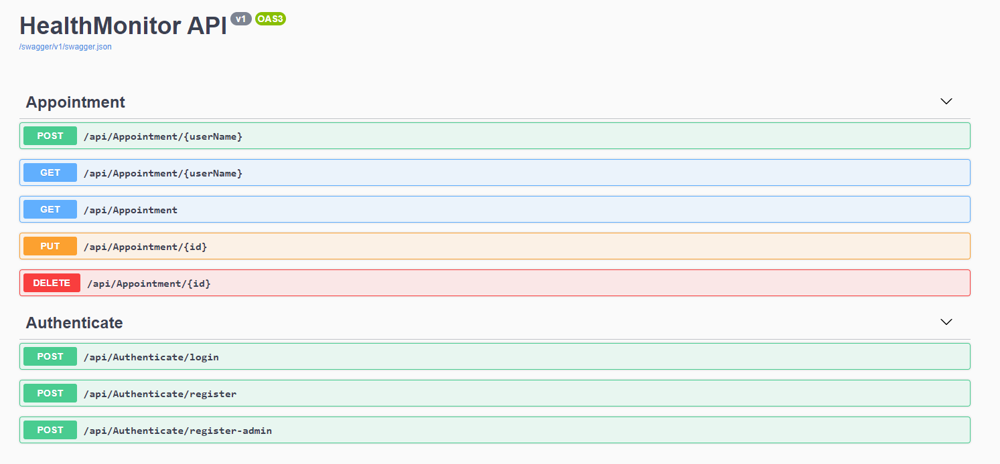

# 

# HealthyOrg Health Monitoring API

## Introduction

Created by - Kenny Nguyen for 2020 MSA - Phase 2 Assignment. This is the **back-end** repo.

For the **front-end repo please see [HealthMonitoring](https://github.com/road2paradise/HealthMonitoring)**

This back-end is hosted on Microsoft Azure and using SwaggerUI. Please click the [Link](https://healthmonitoringapi.azurewebsites.net/swagger/index.html) to see the API endpoints.

## Basic Overview

HealthyOrg helps users keep track with their doctors appointments whether it be on-the-go (mobile) or at home (internet).

### Database and Schema

My back-end consists of two main models. An `AuthenticatedUser` and `Appointment`. The relationship between the two is a one to many relationship where `users` can have multiple `appointments`. The Schema for the two are as follows.

**Authenticated User or ApplicationUser Schema.**

```json
ApplicationUser {
    userID*	integer($int32),
    id	string,
    nullable: true,
    userName	string,
    nullable: true,
    normalizedUserName	string,
    nullable: true,
    email	string,
    nullable: true,
    normalizedEmail	string,
    ...
    accessFailedCount	integer($int32)
}
```

**Appointment Schema**

```json
Appointment {
    appointmentID*	integer($int32),
    appointmentType*	string,
    appointmentDesc*	string,
    appointmentText*	string,
    doctorsName*	string,
    applicationUser { ApplicationUser }
}
```

Each `Appointment` has an associated `ApplicationUser` in which one user can have multiple appointments.

### Routes

There are 2 main sets of controllers with 8 total endpoints, Appointment and Authentication.

**Appointment**

Appointment endpoints are protected by Authorize, which is a package which allows only authenticated users to access these routes. This is checked by comparing the JWT that is stored in the server with that which is being sent from the front-end. Once this authentication is complete the end-points are then exposed to the user to access their own personal data.

All these endpoints are protected, only authenticated users with a valid JWT token can access.

These are my basic CRUD Rest API endpoints.

The routes are shown below:



### Authenticate

Authenticate endpoints act as sign in and register endpoints for my front end.

`/api/Authenticate/login`

Allows for my users to log in, which they provide their `username` and `password`. My back-end then checks this against what is stored in the database and if it is successful, then returns a JWT to authenticate that user, this is then used to access the `Appointment` endpoints.

`/api/Authenticate/register` and `/api/Authenticate/register-admin`

These two routes are similar, but differ in the fact that one user is registered as a normal `user` and one will be registered as an `admin` - _which I was going to expand to incorporate doctors to see their upcoming appointments._

When the user registers through the front-end the email and username are both checked against the data stored in the database to check if there are multiple sign-ups by the same user. If not then a success message will appear and the user will them be prompted to sign in using their newly created `username` and `password`

## Advanced Features (Attempted)

_feelsbadman I took too long with authentication that I couldnt attempt 5_

- Custom Logo's and themeing
  I used a custom logo which I designed from scratch myself, I also used MaterialUI library and created themes for the buttons, forms etc.

  

- Authentication using JWT

Authentication is completed on the server-side. A token is sent via the server and this is saved as a cookie on the client-side, which is then sent whenever there are _sensitive_ routes / api endpoints that are protected against those who are not authorized.

An example of this in action is below, where the JWT is taken in as a cookie and sent through the authorization header. This is required when a user is trying to access their own dashboard which holds sensitive information about their treatment(s)

- Relational Databases

A MySQL server has been created on Microsoft Azure and the tables have been set up such that ApplicationUsers have a one to many relationship to Appointments. Please see above

- ResponsiveUI (Web + Mobile)

My web-app is able to be viewed comfortably and has a responsive UI for switching between Web and Mobile interfaces. There is a hamburger stack for Navigation tools.

- Security

The appointment endpoints are all protected by authentication, valid JWT tokens are required to access these endpoints.
